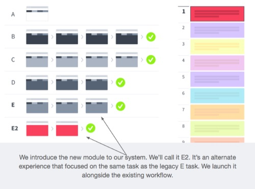
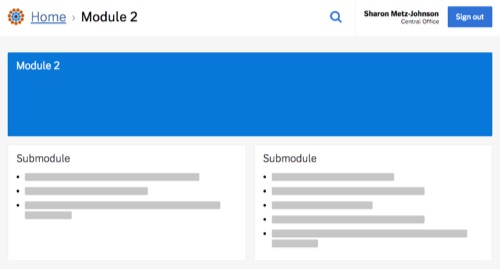

# Modular product design strategy

Alaska is shifting development of the ARIES system to a more fully modular approach.

Beyond technical modularity, which was begun with the initial ARIES development, **we’ll also be utilizing modular procurement and modular product design techniques.**

### Implications of modular procurement

We will be soliciting vendors through a **series of modular contracts** to develop components to improve and extend the functionality of the ARIES system.

We believe this approach will reduce risk, be a better value to Alaskans, deliver important features to users faster, and increase opportunities for the vendor community to participate. We have greater confidence that we will get working code from vendors into users' hands faster through modular procurements than with a single, traditional, big contract.

But it also introduces challenges from a product design perspective. How do we keep moving ARIES forward without imposing the burden of maintaining/building upon legacy code on new vendors? How do we incorporate the work of multiple teams into a cohesive overall product architecture?

We'll do this through an incremental transition to a more modular product architecture.

### Incremental transition

To facilitate this modular approach to system development, we will be incrementally shifting toward a modular product architecture. New development will be "loosely coupled" to the existing product. We'll then incrementally shift responsibilities to the new modules.

**We've illustrated the strategy in this presentation: ["Incrementally shifting toward a modular experience" presentation](assets/modular-experience.pdf).**

### Unified product design

With multiple parties working on different modules, we want to **provide just enough guidance to free each team to focus on the desired outcomes and user needs pertinent to their module**, not global product design concerns. We want to explain how their modules will fit within the larger whole. At the same time, we are cautious about optimizing too early, or being overly prescriptive at this stage.

In the long run, we intend to have a unified, shared UI pattern library that will provide a consistent user experience across modules and provide a means for system-wide UI changes. However, we don't want the creation of that library to be overly speculative or delay progress in other areas. It will take work over time, likely through multiple module projects, for those patterns to be identified. 

Our solution at this point establishes a limited number of design constraints that will tie the loosely coupled modules together. This will incur some acceptable technical debt, but it will allow forward progress and can be paid down at the appropriate point in the future as patterns are established through module-based work. We anticipate reassessing this approach as we learn from each module and our users.

Moving forward we plan to:

- Adopt a hub-and-spoke global navigation scheme, where the homepage is the hub and modules are the spokes.
- Share identity/authentication across the system for fluid user movement between pages/modules
- Treat the homepage and search as primary means of navigation across the system

**We have developed a [demonstration website](http://federalist.18f.gov.s3-website-us-east-1.amazonaws.com/site/18f/united/portal.html) that illustrates these patterns.** 

For new modules being developed, each will adopt a global header comprised of the ARIES logo/link to home, breadcrumb navigation, link to search start screen, the user's name and office, and logout button. All modules would load efficiently across geographies and display/function properly on different device types and using various modern and necessary browsers. Module teams are not responsible for user interface elements outside of their module.

**Current expectations for contractors delivering new modules**

- New modules must meet the needs of their users. As such, contractors should introduce UI patterns that best allow their users to accomplish their tasks. 
- Contractors are not expected to adhere to the existing user interface styles or patterns, but recognize that users will be moving between the existing ARIES experience and new module experiences constantly throughout their day.
- Over time, we anticipate shared UI patterns will emerge and shared libraries may be developed. At this time, we do not want to prematurely optimize for that future state.
- The one prescriptive design choice imposed on new modules is that they should institute a global header design including the ARIES logo/link to home, breadcrumb navigation, link to search home, the user's name and office, and logout button.
- For subsequent modules, Alaska will reevaluate this approach and may adjust course as needed.

